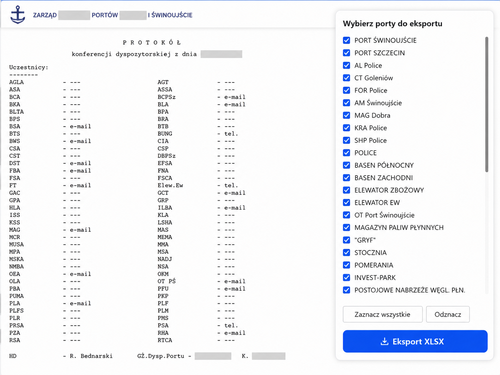

# Tampermonkey Userscripts

A curated collection of self-contained Tampermonkey userscripts for enhancing existing web applications, automating repetitive browser workflows, and improving day-to-day productivity.

The repository focuses on practical browser-side automation: extending existing user interfaces, extracting structured data from pages, adding missing workflow actions, and reducing repetitive manual work without modifying the original application source code.

Each userscript is designed to stay plug-and-play: install it directly in Tampermonkey as a single `.user.js` file, without a build step.

## Repository structure

```text
tampermonkey-userscripts/
  assets/
    port-szczecin-panel.png

  port-szczecin/
    README.md
    port-szczecin-export-xlsx.user.js

  registry-workflow-sanitized/
    README.md
    registry-acquired-cards-assistant-auto-record.user.js
    registry-auto-treatment-entry.user.js
    registry-record-accept-from-card-search.user.js
    registry-record-extra-info.user.js
    registry-transport-cards-assistant.user.js
```

## Scripts

### Port Szczecin - XLSX Export

A browser-side export helper for a public port dispatch page. The script parses the visible daily schedule, adds a floating selection panel, allows users to choose ports, and exports structured data to an XLSX workbook.



Highlights:

- Floating port selection panel
- Select all / deselect all controls
- Direct XLSX export from the browser
- Parsing of fixed-width schedule rows
- Separate worksheet for water level data when available
- No backend, no credentials, no build step

Documentation: [`port-szczecin/README.md`](port-szczecin/README.md)

---

### Registry Workflow - sanitized userscripts

A set of sanitized userscripts originally designed for workflow automation in an environmental registry-style web application. The scripts demonstrate how Tampermonkey can extend existing systems with row-level actions, data previews, validation, and controlled browser-side automation.

The public version intentionally keeps domain-level context, such as transfer cards, waste records, treatment entries, and transport confirmations, while removing direct references to the original production system, real domains, and sensitive data.

Highlights:

- DOM augmentation for existing tables and modal dialogs
- Contextual row-level action buttons
- Fetch-based integration with authenticated backend endpoints
- Request payload reconstruction from visible UI state
- Input normalization for dates, identifiers, masses, and codes
- MutationObserver support for dynamic or partially SPA-like pages
- Validation before high-impact write actions
- Defensive error handling and user-facing status feedback

Documentation: [`registry-workflow-sanitized/README.md`](registry-workflow-sanitized/README.md)

## Installation

1. Install Tampermonkey in your browser.
2. Open one of the `.user.js` files from this repository.
3. Copy the file content into a new Tampermonkey script.
4. Review the `@match` section.
5. Adjust placeholder domains and endpoints only for systems where you are authorized to use browser-side automation.
6. Save and enable the script.
7. Open the supported page and verify the UI changes.

## Status

- `port-szczecin` contains a functional userscript for the supported public dispatch page.
- `registry-workflow-sanitized` contains sanitized portfolio examples. They preserve the architecture and workflow patterns, but placeholder domains and endpoint paths must be adapted before use in any authorized environment.

## Safety and usage notes

These scripts modify the browser-side UI of existing web applications. Some registry workflow examples also send authenticated requests using the current browser session.

Before using similar scripts in a real environment:

- verify that automation is allowed by the application owner and applicable terms of service,
- test on non-production or low-risk data first,
- keep debug logging disabled when processing business data,
- avoid storing credentials, tokens, or personal data in userscripts,
- review every endpoint and request payload before enabling write actions,
- treat scripts that create, accept, reject, or modify records as high-impact automation,
- document which workflow steps are automated and which remain under user control.

## Development principles

This repository intentionally keeps every userscript as a single `.user.js` file because Tampermonkey scripts should be easy to inspect, copy, install, and disable.

The scripts follow these principles:

- one file per userscript,
- no build step required,
- small helper functions instead of external modules,
- defensive DOM querying,
- explicit validation before write actions,
- minimal global state,
- visible UI feedback for long-running actions,
- no credentials or secrets in source code,
- sanitized public examples for sensitive workflows.

## Disclaimer

This repository contains unofficial browser-side enhancements. The scripts are provided for educational, portfolio, and controlled internal-use scenarios. Use them only where you have permission to automate the target workflow.

The registry workflow scripts are sanitized examples and are not affiliated with, endorsed by, or distributed by the operator of any public registry system.
